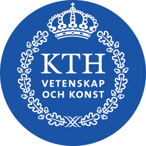

<!-- This template uses html code to offer a bit prettier formatting. This html
code is limited to the header and footer. The main body is and should be written
in markdown. -->

<h1 align="center" position="relative">
  <br>
  
  <br>
  <br>
  <span>enterpriseLang</span>
  <br>

  <!-- Below, there are 4 small button-like images. These are called "badges"
  and are popular on Github. You can create your own or edit the ones below.
  They are useful for adding quick links to external files or to add badges for
  your project. Each one consists of a link (`<a href=..`) and an ``
  tag. Edit the link t point to where you want. Delete the badges that you don't
  need. -->

  <a href="https://www.gnu.org/licenses/gpl-3.0.html">
    
  </a>

  <a href="https://img.shields.io/badge/license-gpl_v3-be0000">
    <!-- You can edit the `Overleaf-paper` part in the next link to change the
         text of the created badge. -->
    
  </a>

  <a href="https://www.duckduckgo.com">
    
  </a>

  <a href="https://img.shields.io/badge/license-gpl_v3-be0000">
    
  </a>
  <br>
</h1>

<p align="justify"> 
The enterpriseLang is a MAL-based domain specific language for assessing the cyber security of enterprise systems.
<p>

## Table of contents
- [Quick Info](#quick-info)
  * [Project links](https://github.com/mal-lang/enterpriseLang)
- [Description](#description)
- [Work Products](#work-products)
- [Resources](#resources)

## Quick Info

- Active members:
  - [Wenjun Xiong](https://www.kth.se/profile/wenjx/)
- Status: running :green_circle:
- Timeline: 2019-2021

### Project links

- [enterpriseLang](https://github.com/mal-lang/enterpriseLang)

## Description

enterpriselang is a domain-specific MAL language based on the MITRE ATT&CK® Matrix, which intends to assess the cyber security of enterprise systems from a holistic point of view.

* We keep updating the file `enterpriselang.mal` and the folder `securiCAD_models`. The files within the folder `single_attacks` are not up-to-date, please refer to the file `enterpriselang.mal`. The `pom.xml` shall be used to support advanced distributions.
* The test cases can be found in `src/test/java/org/mal_lang/enterpriselang/test/`, while another `pom.xml` in the folder `src` shall be used for testing.
* Please compile the language with the following command on the command line run in securiCAD:
```
mvn clean package -PsecuriCAD -Dmaven.test.skip
```

### This project can be built according to exampleLang instructions (https://github.com/mal-lang/exampleLang)

* The file `pom.xml` is the Maven configuration file of the project, make sure that <kernelcad.version> is 1.6.2-SNAPSHOT in pom.xml. 
* The directory `src/main/mal` contains the MAL specification
  `exampleLang.mal`, which is the MAL specification of exampleLang.
* The directory `src/main/resources/icons` contains SVG icons for the
  assets in exampleLang.
* The directory `src/test/java/org/mal_lang/examplelang/test`
  contains the unit tests of exampleLang.
* It requires a new alpha version of securiCAD Professional. The instructions on how to download it here: https://github.com/foreseeti/foreseeti-maven-repo.

## Work Products

- [x] enterpriseLang v1 - threat modeling
- [ ] enterpriseLang v2 - attack simulations (in progress) 
- [ ] enterpriseLang - validation / testing

## Resources
- [enterpriseLang](https://github.com/mal-lang/enterpriseLang)
- [MAL - Meta Attack Language](https://mal-lang.org)
- [SecuriCAD](https://foreseeti.com)

<br>

  <a href="https://www.kth.se/nse/research/software-systems-architecture-and-security/" >
    
  </a>

- - - -
This is a project run by the [Software Systems Architecture and Security research
group](https://www.kth.se/nse/research/software-systems-architecture-and-security/)
within the [Division of Network and Systems Engineering](https://kth.se/nse) at
the Department of Computer Science at the School of [Electrical Engineering and
Computer Science](https://www.kth.se/en/eecs) @ [KTH university](https://www.kth.se).

For more of our projects, see the [SSAS page at
github.com](https://github.com/KTH-SSAS).
